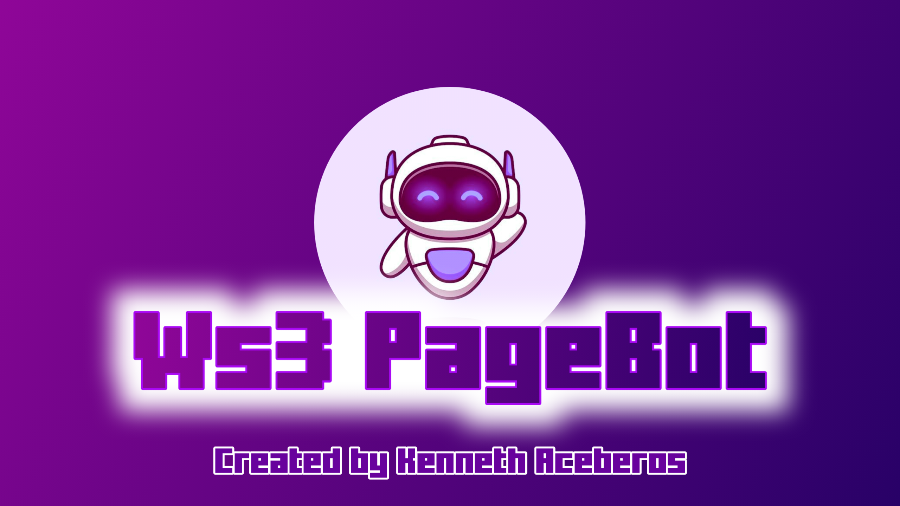
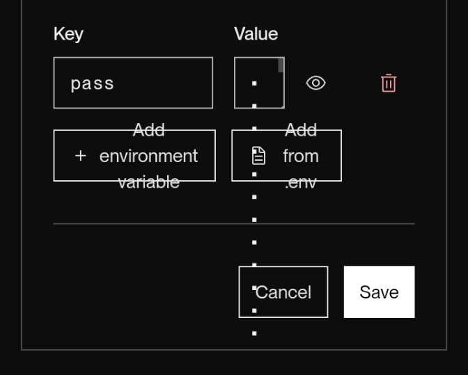
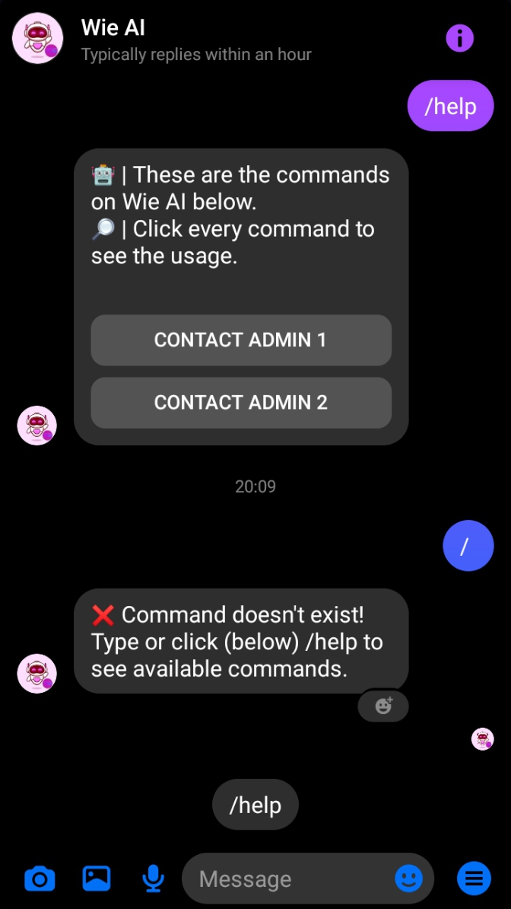

<!DOCTYPE html>
<html lang="en">

# Ws3 PageBot
Created by Kenneth Aceberos

# Features
- **Mirai/autobot command structure** (Commands are in `ws3/commands`)
- **1 hour auto post** (You can change your own on `page_bot.js`)
- **Auto git pull on your repo every restart** (Need public) (Check on `main.js` for reference)
- **With commands menu, quick replies and buttons** (You can customize your own)
- **Webpage with some detail and restart bot feature**

This page bot is originally from: [https://github.com/muhammadoren/Ai-Page-Bot](https://github.com/muhammadoren/Ai-Page-Bot).

**Ws3 PageBot is a dedication to her (my gf).**

## Prerequisites
Before starting, ensure you have a Facebook Page. If you don't have one, create a Facebook Page first.

## Step 1: Go to Facebook Developers
1. **Navigate to Facebook Developers:**
   - Open your web browser and go to [developers.facebook.com](https://developers.facebook.com).

2. **Create a Developer Account (if you don’t have one):**
   - If you’re new to Facebook Developers, log in with your Facebook credentials and follow the prompts to set up a developer account.

## Step 2: Create an App
1. **Create an App:**
   - Click on "My Apps" in the top-right corner.
   - Select "Create App".
   - Choose "Business" as the type of app.
   - Fill out the required details such as the app display name and contact email, then click "Create App ID".

## Step 3: Add Messenger Product
1. **Add Messenger:**
   - In the left sidebar of your app's dashboard, click on "Add Product".
   - Find "Messenger" and click on the "Set Up" button next to it.

## Step 4: Connect Your Facebook Page
1. **Generate a Page Access Token:**
   - Scroll down to the "Access Tokens" section.
   - Click on "Add or Remove Pages".
   - Follow the prompts to connect your Facebook Page.
   - Once connected, generate a Page Access Token by clicking "Generate Token". Copy this token for later use.
   
## Step 5: Set Up Webhooks
  1. **Create a web service on Render / or any hosting site**
   - Open [render.com](https://render.com)
   - Sign Up and connect by your GitHub account.
   - Click 3 dots > New > Web Service
   - Go back to Github, Fork this repo and go back to render.
   - Refresh then find the repo that you fork.
   
   **NOW FOR THE IMPORTANT PARTS**
    
   - Build command: `npm install`
   - Start command: `node main.js`
   - On Environmental Variables:
   Create your own password for the restart bot feature.
    
   Key: `pass`
    
   Value: `<your desired password>`
   - See and follow the picture below: 
   
   - Default Password is: `ws3`
   - I RECOMMEND YOU TO CHANGE PASSWORD BY ENCRYPT OR PUT THE PASSWORD BY ENVIRONMENTS IF YOU DON'T WANT TO BE PLAYED AND FOOLED BY SOMEONE. I'M WARNING YOU ⚠️
   
   - And now for the git pull feature, add an environmental variable again:
   
   Key: `repo`
   
   Value: `<your forked repo>`
    
   - on Advanced section: **DO NOT FORGET TO TURN OFF (No) AUTO DEPLOY for GIT PULL**
   
   - Then Create Web Service
   **Once it's done lets proceed to the next procedure.**
  2. **Configure the Webhooks (Messenger)**
   - In the Messenger settings, scroll to the "Webhooks" section.
   - Click on "Setup Webhooks".
   - Enter the following details:
     - **Callback URL:** `https://your_hosting.site/webhook`
     - **Verify Token:** `ws3`
   - Subscribe to the following fields:
     - `messages`
     - `messaging_optins`
     - `messaging_postbacks`
     - `feed`
   - Click "Verify and Save".

## Step 6: Add Page Subscriptions
1. **Subscribe to Page Events:**
   - Still in the Webhooks section, under "Page Subscriptions", select the page you connected earlier.
   - Ensure that `messages`, `messaging_optins`, `messaging_postbacks`, and `feed` are selected for this subscription.

## Step 7: Get Your Page Access Token
1. **Retrieve Token:**
   - Go back to the "Access Tokens" section.
   - Copy the generated Page Access Token.

## Step 8: Enter Page Access Token
1. **Configure Bot with Token:**
   - Paste the Page Access Token into `ws3/api.js` on `const token`
   
   I recommend you for your security: **Put your token on Environment Variables**
   Just edit the environment variables on "Environments" tab
   - Add an environmental variable:
    
   Key: `token`
   
   Value: `<your copied page access token>`
   
   - Then SAVE 
   
## Step 9: Test Your Messenger Bot
1. **Test Bot Functionality:**
   - Open your connected Facebook Page.
   - Send a message to your page.
   - Just send the prefix(Default is "/") or "hi" to check if it's now working.

## Note:
- You're in developer mode, that means that the bot only respond to accounts that have specific roles assigned within the app. To use the bot from a different account or user, Just switch to Live Mode and now your bot is ready to go 😉

## How to switch to Live Mode?
- Find **App Mode** then switch to Live
- Follow some requirements before you can switch to Live Mode.

**(I think it's Privacy Policy and Terms of Service requires it, Just use the facebook's privacy policy and terms of Service.)**

- You're Done

**You can now use the bot to all users once they messaged you**

## Credits
  - This file is originally from muhammadoren's [Ai-Page-Bot](https://github.com/muhammadoren/Ai-Page-Bot).
  - **Joshua sy (deku)** - API
  - **All developers and coders on ChatBot Community** - for helping to build this page bot
    
  **Note!**
   - You are free to modify this file. You can do whatever you want.
   

</html>